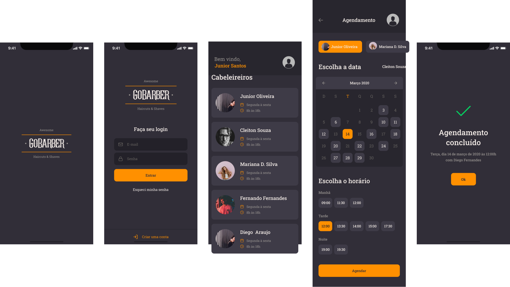

<h1 align="center">
    
</h1>

  <a href="#-technologies">Technologies</a>&nbsp;&nbsp;&nbsp;|&nbsp;&nbsp;&nbsp;
  <a href="#-project">Project</a>&nbsp;&nbsp;&nbsp;|&nbsp;&nbsp;&nbsp;
  <a href="#-layout">Layout</a>&nbsp;&nbsp;&nbsp;|&nbsp;&nbsp;&nbsp;

 

  

 

  

  

## 🚀 Technologies

This project was developed with:

- [Node.js](https://nodejs.org/en/)
- [React](https://reactjs.org)
- [React Native](https://facebook.github.io/react-native/)
- [TypeScript](https://www.typescriptlang.org/)
- [Styled Components](https://styled-components.com/)
- [Docker](https://www.docker.com/)
- [PostgreSQL](https://www.postgresql.org/)
- [MondoDB](https://www.mongodb.com/)
- [Redis](https://redis.io/)
- [JWT](https://jwt.io/)

## 💻 Project

GoBarber is a complete application to connect barbers to clients. Barbers can register on the web platform, choosing their days and working hours. Through the mobile app, users can list all professionals, view available hours on a specific day and schedule their appointment.

Developed during [Rocketseat](https://rocketseat.com.br/) <strong> Bootcamp GoStack 11 </strong>.